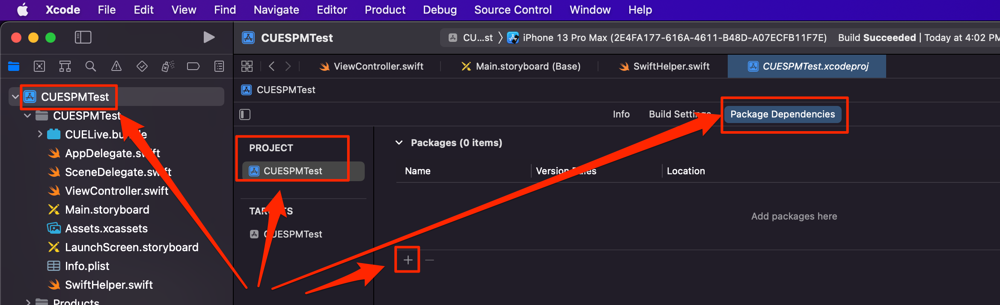
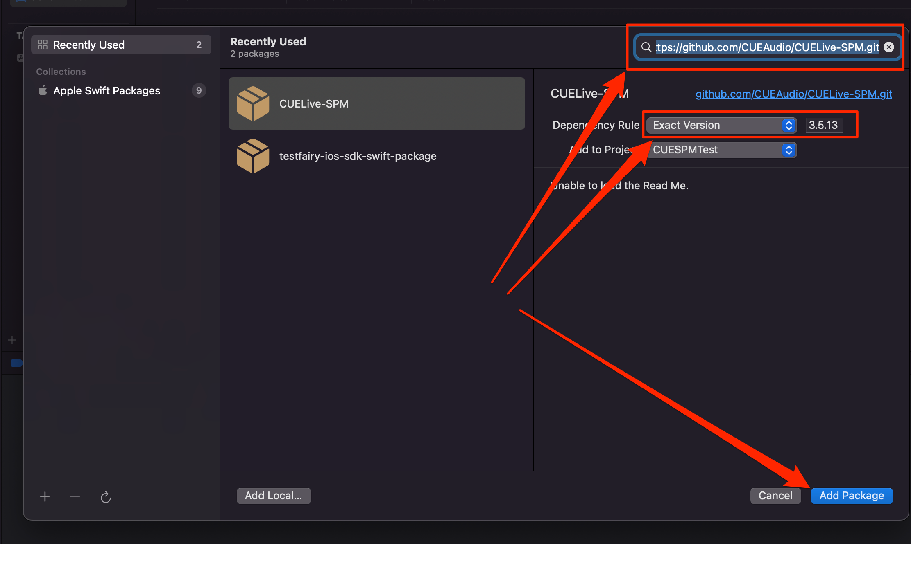
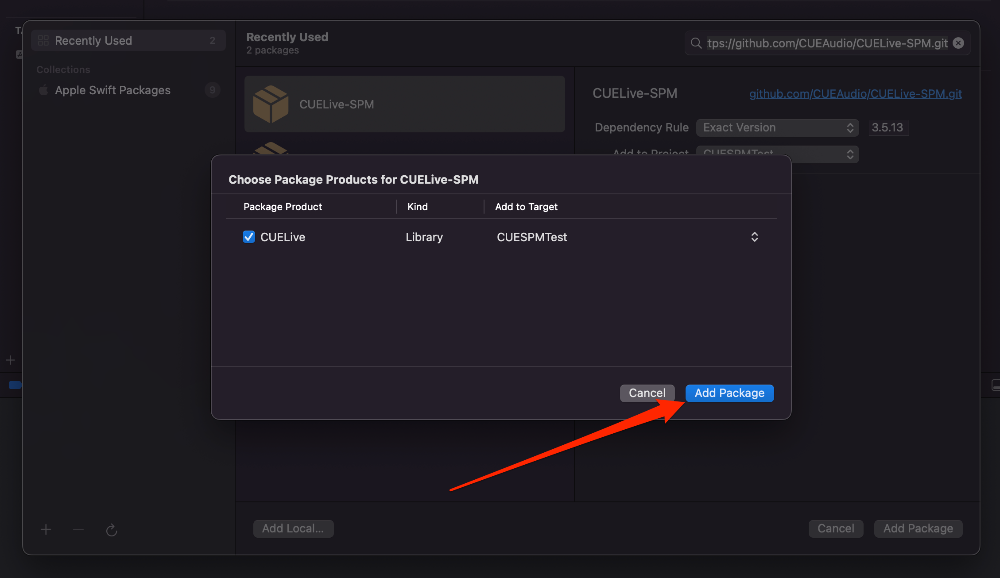
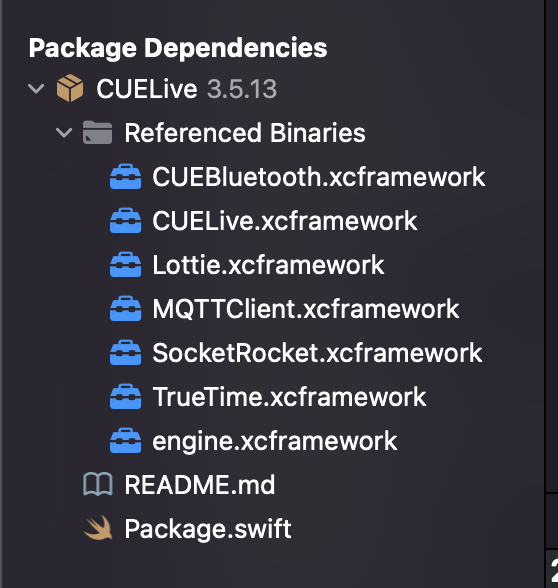
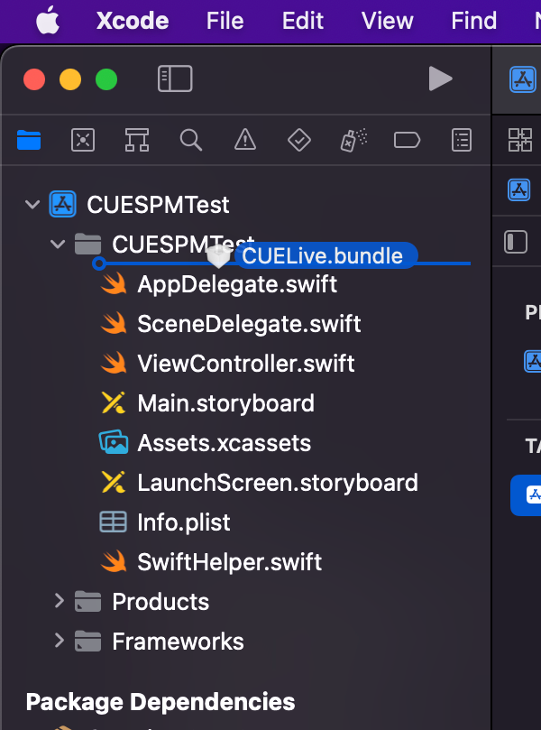
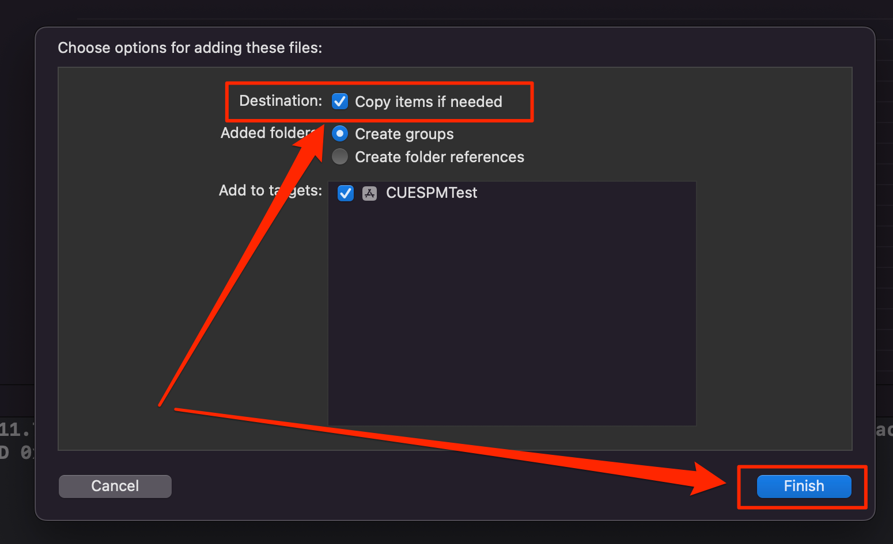
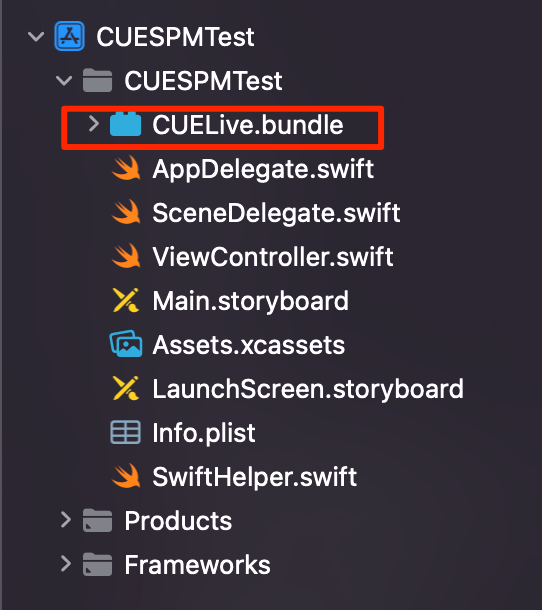
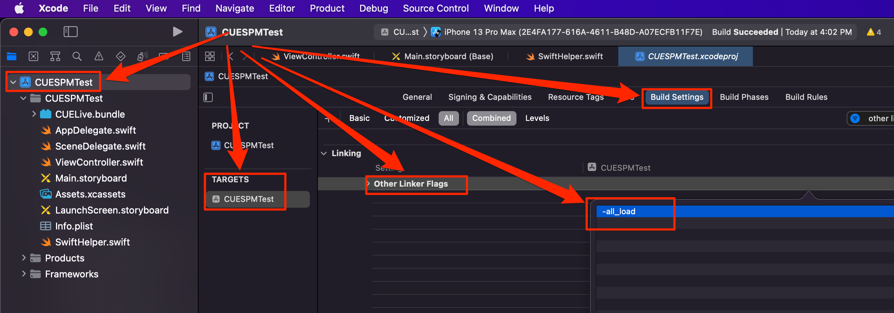

# CUELive-SPM

## Add the CUELive SDK

Add the CUELive framework using the Package manager in Xcode. Use the URL: `https://github.com/CUEAudio/CUELive-SPM.git`

Once the dialog for the package manager is opened, search for the CUELive SPM in the search field at the top right. Enter the following URL to help discover the package: `https://github.com/CUEAudio/CUELive-SPM.git`.

Once the package has been downloaded, specify the Target you wish to add the CUELive SDK to.

You will see the like of installed packages in Project Navigator in the _Package Dependencies_

## Adding the required `.bundle`

Download the resource bundle (file with `.bundle` extension) [here](https://swift-package-manager.s3.amazonaws.com/bundles/default-bundle.zip). Drag and drop the file into your project

Make sure to select the `Copy items if needed` is selected. Click Finish.

Verify that the bundle can now be seen in the Project Navigator

## Modifying the Build Settings

Next add the `-all_load` linker flag to the build target. Look for "Other linker flags" in the Build Settings of the target, and add the `-all_load` flag

